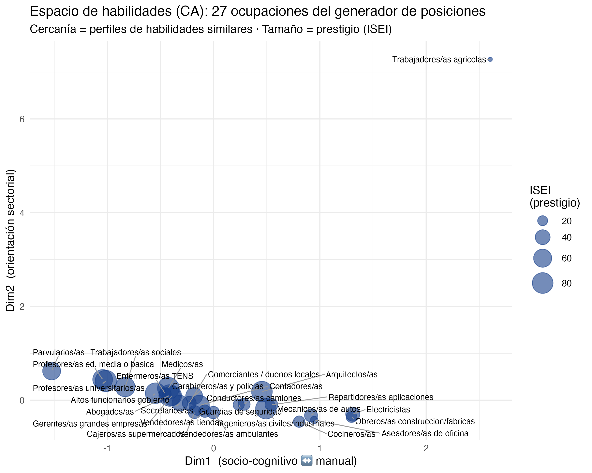
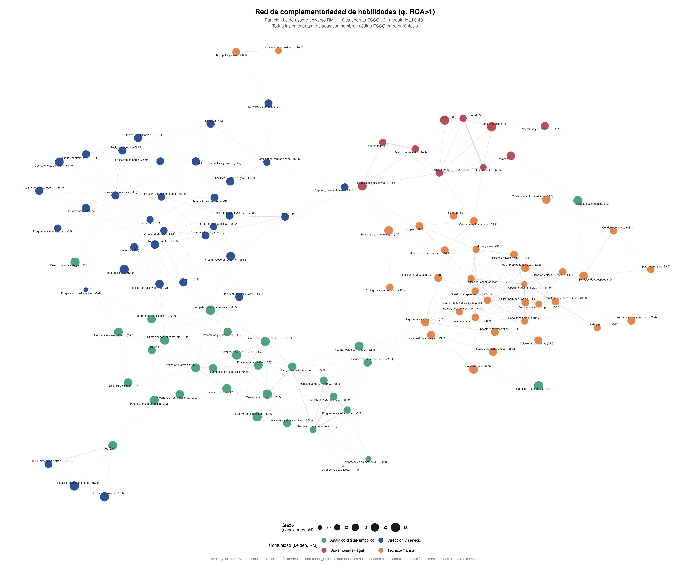

::: columns
::: {.column width="15%"}

{width=100%}

:::

::: {.column .column-right width="85%"}

## **Más allá del prestigio: análisis de clase sobre el espacio relacional de habilidades en las redes personales en la Región Metropolitana**

**Trajan Pirkovic Palma^1^ ^2^**

**^1^Instituto de Sociología, Pontificia Universidad Católica de Chile**

**^2^Fondecyt: Class, personal networks and political attitudes**

Comisión de tesis · Estado de avance

Profesora Guía: Andrea Canales

Profesor Co-Tutor: Gabriel Otero

19 de agosto 2026

:::
:::

## **Últimos cambios desde la Entrega 3**

::: {.incremental .highlight-last style="font-size: 82%;"}

- El espacio de habilidades ahora se estima **ponderado por la población ocupada de la RM** (CASEN 2024), en lugar del universo europeo de ESCO sin ponderar
- La detección de comunidades de habilidades pasa de Louvain a **Leiden**, y las comunidades se identifican por su contenido, no por un número arbitrario
- Las hipótesis se reformulan: de H1-H3 a **H1, H1b, H2, H3, H4**. La hipótesis de ingreso laboral queda fuera del cuerpo de hipótesis formales — pasa a otra línea de investigación
- Se agrega un indicador de **cierre estructural** de la red (H4), que no existía en la Entrega 3
- Los modelos de H1/H1b incorporan controles de sexo, edad y educación desde el modelo base, siguiendo a Espinosa-Rada, Bargsted y Ortiz Ruiz (2026)

:::

::: {.box-inv-4 .sp-after .fragment style="font-size: 80%;"}
En síntesis: **misma pregunta, diseño más afinado.** Lo que sigue son los resultados con esta versión.
:::

# El planteamiento {.xlarge data-background-color="#173F8A"}

## **P1 — el espacio de habilidades y por qué el prestigio no basta**

::: columns
::: {.column width="52%"}

{width=92%}

:::

::: {.column width="48%"}

::: {.incremental .highlight-last style="font-size: 70%;"}

- CA sobre las ocupaciones de la RM, ponderadas por población real; aquí, las 27 posiciones del generador
- Dim1 (socio-cognitivo ↔ manual) correlaciona con ISEI en **r = −0,65**: sustantivo, pero deja más de la mitad de la varianza sin explicar
- Dim2 (orientación sectorial) **no correlaciona con el prestigio** (r = 0,03)
- Trabajadores/as agrícolas: caso extremo en Dim2, baja masa poblacional en la RM urbana — limitación conocida del CA

:::

:::
:::

::: {.box-inv-4 .sp-after .fragment style="font-size: 68%;"}
Si el contenido de habilidades no es una copia del prestigio, la forma en que las personas se conocen también podría organizarse por ese contenido, no solo por estatus. Esa es la apuesta de la tesis.
:::

## **Qué es una habilidad, sociológicamente**

::: {.incremental .highlight-last style="font-size: 88%;"}

- No es rango ni estatus: es la **capacidad de aplicar conocimiento a tareas de un dominio** (ESCO)
- Wright (2005): *skill assets*, activos productivos que fundamentan posición de clase
- Araki (2020): las habilidades no se devalúan al masificarse como sí ocurre con la **credencial educativa** — otra pista de que no son intercambiables entre sí
- Dos ocupaciones con ISEI similar pueden pertenecer a **comunidades de habilidades y mecanismos de cierre distintos**

:::

::: {.box-inv-4 .sp-after .fragment style="font-size: 90%;"}
**El ISEI no distingue eso; el contenido de habilidades sí.**
:::

## **Cadena argumental**

::: {.incremental .highlight-last style="font-size: 82%;"}

- Desigualdad extrema en Chile → clausura social de clase → homofilia relacional → medida casi solo vía prestigio ocupacional
- Prestigio, clase y educación son colineales entre sí: miden en gran parte la misma jerarquía subyacente
- Una habilidad es un activo con lógica propia (Wright, 2005), no reducible a esa jerarquía

:::

::: {.box-inv-4 .sp-after .fragment style="font-size: 84%;"}
→ La homofilia de habilidades puede ser una **dimensión autónoma de clausura relacional**, distinta de la clausura por estatus que ya documenta la literatura chilena.
:::

# El planteamiento {.xlarge data-background-color="#173F8A"}

## **Dos preguntas, cinco hipótesis**

::: {.box-inv-4 .sp-after style="font-size: 82%;"}
**P1 (estructural):** ¿cómo se organiza el espacio de habilidades de las ocupaciones, y en qué medida coincide o diverge de la jerarquía de prestigio?
:::

::: {.box-inv-4 .sp-after style="font-size: 82%;"}
**P2 (relacional):** ¿la composición de habilidades de las redes personales varía según clase de origen, y se asocia con el perfil del ego y con el cierre de su red, más allá del prestigio?
:::

::: {style="font-size: 66%;"}

| | Hipótesis |
|---|---|
| **H1** | Se conoce a más gente en ocupaciones con habilidades parecidas a las propias, más allá del prestigio |
| **H1b** | Esa homofilia de habilidades varía según el nivel educativo del ego |
| **H2** | Quienes vienen de origen social más alto tienen redes con habilidades más diversas |
| **H3** | La composición de comunidades de habilidades de la red corresponde a la de la ocupación del ego, por sobre el prestigio de la red |
| **H4** | Quienes vienen de origen social más alto tienen redes con **menor cierre estructural** |

:::

# Datos y construcción {.xlarge data-background-color="#173F8A"}

## **Fuentes**

| Fuente | Qué aporta |
|---|---|
| **Encuesta Fondecyt** | Egos y redes: N = 1.251, RM. Generador de posiciones, 27 ocupaciones (Q0101-Q0127) |
| **ESCO** (versión es) | Catálogo de habilidades: ~3.000 ocupaciones, 110 categorías (nivel L2) |
| **ISCO-08** | Puente entre fuentes: código ocupacional de egos, alters y padres |
| **Ganzeboom (2010)** | Prestigio: tabla oficial ISEI-08, 590 códigos |
| **CASEN 2024** | Universo ocupacional de la RM y peso poblacional de cada ocupación |

::: {.box-inv-4 .sp-after .fragment style="font-size: 82%;"}
El generador de posiciones pregunta, para 27 ocupaciones: *"¿a cuántas personas conoces que trabajen en esto?"* (Lin & Dumin, 1986). Egos con ocupación válida y match ISCO: **n = 978-975** según el modelo.
:::

## **Glosario de indicadores**

::: {style="font-size: 62%;"}

| Indicador | Nombre en esta presentación | Qué mide |
|---|---|---|
| `SH_ip` | Similitud de habilidades ego-posición | Cercanía en el mapa de habilidades entre la ocupación de ego y cada posición del generador |
| `SP_ip` | Similitud de prestigio ego-posición | Cercanía en ISEI entre ego y cada posición, el contraste clásico |
| `Div_Red` | Amplitud de habilidades de la red | Cuántas áreas de habilidad distintas cubre el repertorio agregado de la red |
| `share_comX_red` / `share_comX_ego` | Peso de cada comunidad en la red / en ego | Proporción del repertorio de habilidades que cae en cada una de las 4 comunidades |
| `SP_red_ego` | Proximidad de prestigio red-ego | Control crítico de H3: descarta que la correspondencia sea de estatus |
| `cierre_blando` | Cierre estructural | Cuánto se solapa el perfil de habilidades de ego con el de su red, ponderado por contactos |
| `Ext` · `Rango_P` · `Estatus_Max` | Extensión · Rango de prestigio · Estatus máximo | Los tres indicadores clásicos del generador de posiciones, usados como controles/contraste |

:::

# Resultados: P1 {.xlarge data-background-color="#173F8A"}

::: {style="font-size: 55%; font-style: italic; margin-top: 2em;"}
¿Cómo se organiza el espacio de habilidades de las ocupaciones, y en qué medida coincide o diverge de la jerarquía de prestigio?
:::

## **Comunidades de habilidades: cómo se detectan**

::: {.incremental .highlight-last style="font-size: 82%;"}

1. **¿Qué habilidades "van juntas"?** Para cada ocupación se identifican las habilidades que usa más de lo esperable para su tamaño en la economía — no solo las que tiene, sino las que la distinguen
2. **Se conectan las habilidades que aparecen juntas** en muchas ocupaciones, más seguido de lo que pasaría por azar. Eso arma una red: dos habilidades muy conectadas tienden a convivir en el mismo trabajo
3. **Un algoritmo agrupa esa red en bloques** de habilidades densamente conectadas entre sí — esos bloques son las "comunidades"
4. Se aplica el mismo procedimiento de **Alabdulkareem et al. (2018)**, sobre las ocupaciones de la RM

:::

::: {.box-inv-4 .sp-after .fragment style="font-size: 72%;"}
**Robustez** *(nota al pie)*: el hallazgo se replica vía bootstrap sobre reordenamientos de ocupaciones y frente a distintos umbrales de phi; no se detalla aquí por tiempo.
:::

## **Ejemplo: ocupaciones que comparten habilidades**

::: {style="font-size: 58%;"}

| Par de ocupaciones | Comunidad | Habilidades esenciales compartidas | Ejemplos |
|---|---|---|---|
| Veterinario/a general ↔ Ganadero/a | Bio-ambiental-legal | 7 de 53 / de las de ganadero/a | Bioseguridad animal; primeros auxilios a animales; higiene animal; controlar el movimiento de animales |
| Desarrollador/a de software ↔ Ingeniero/a de aplicaciones | Analítico-digital-simbólico | 16 de 24 | Programación informática; identificar requisitos del cliente; analizar especificaciones de software |
| Ingeniero/a civil ↔ Ingeniero/a de automatización | Técnico-manual | 14 de 30 | Modificar diseños técnicos; dibujos técnicos; gestionar datos de investigación |
| Médico/a generalista ↔ Kinesiólogo/a | Dirección y servicio | 8 de 10 | Sintetizar información; evaluar condiciones físicas de clientes; conocimientos especializados de disciplina |

:::

::: {.box-inv-4 .sp-after .fragment style="font-size: 72%;"}
Este es el mecanismo detrás de phi: dos ocupaciones "aparentemente" distintas resultan cercanas en el mapa porque comparten un tramo real de su lista de habilidades esenciales ESCO — no por pertenecer al mismo rubro o nivel de prestigio. Veterinario/a y ganadero/a están a ~35 puntos de ISEI de distancia, y aun así comparten un tercio de las habilidades del segundo.
:::

## **De dónde vienen los datos: un ejemplo**

::: {style="font-size: 60%;"}

| Ocupación | Comunidad | Algunas habilidades esenciales (ESCO) |
|---|---|---|
| Médico/a generalista | Dirección y servicio | Proporcionar asistencia sanitaria general; evaluar condiciones físicas de pacientes; supervisar desarrollo físico de niños |
| Ingeniero/a civil | Técnico-manual | Ingeniería civil; supervisar proyecto de construcción; garantizar cumplimiento de legislación de seguridad; coordinarse con arquitectos |
| Desarrollador/a de software | Analítico-digital-simbólico | Programación informática; depurar software; desarrollar prototipo de software; usar patrones de diseño de software |
| Veterinario/a general | Bio-ambiental-legal | Fundamentos de ciencias veterinarias; **legislación sobre bienestar de los animales**; realizar diagnósticos veterinarios; recetar medicamentos veterinarios |

:::

::: {.box-inv-4 .sp-after .fragment style="font-size: 74%;"}
Cada ocupación de ESCO trae su propia lista de habilidades esenciales — esta tabla es la unidad básica sobre la que se construye todo el mapa. La habilidad veterinaria "legislación sobre bienestar animal" ya es, en sí misma, la conexión regulatoria que explica por qué Derecho aparece junto a Agricultura y Veterinaria en la comunidad Bio-ambiental-legal.
:::

## **Las cuatro comunidades**

::: columns
::: {.column width="58%"}
{width=100%}
:::
::: {.column width="42%"}

::: {style="font-size: 60%;"}

| Comunidad | Qué agrupa |
|---|---|
| **Dirección y servicio** | Trabajo sobre personas: coordinar, atender, enseñar, vender. Salud, bienestar, educación, ciencias sociales; gestión y cuidado |
| **Técnico-manual** | Trabajo sobre objetos y materia: construir, operar, reparar, transportar. Ingeniería, construcción, industria |
| **Analítico-digital-simbólico** | Trabajo sobre información y símbolos: programar, analizar, escribir. TIC, matemáticas, artes, humanidades, idiomas |
| **Bio-ambiental-legal** | Trabajo sobre organismos vivos y su marco regulatorio. Derecho, biología, ambiente, agricultura, silvicultura, pesca, veterinaria |

:::

::: {style="font-size: 56%;"}
Red de complementariedad phi (RCA>1), partición Leiden sobre el universo RM · 110 categorías ESCO L2 · **modularidad 0,401**
:::

:::
:::

::: {.box-inv-4 .sp-after .fragment style="font-size: 70%;"}
El caso llamativo es la cuarta: el **derecho** aparece junto a agricultura y veterinaria, no junto a lo analítico-digital. ESCO codifica el conocimiento jurídico-regulatorio (normativa fitosanitaria, ambiental, de inocuidad) como habilidad esencial en ocupaciones agropecuarias y sanitarias. Eso vincula al veterinario con el trabajador agrícola por contenido, aunque estén separados por decenas de puntos de ISEI.
:::

## **Ocupaciones de ejemplo: comunidades de habilidades y relación con el GP**

::: {style="font-size: 54%;"}

| Ocupación (posición GP) | ISEI | share Dir.-serv. | share Téc.-man. | share Analít.-dig. | share Bio-amb.-legal |
|---|---|---|---|---|---|
| Parvularios/as (Q0124) | 58,8 | **84,6%** | 0% | 15,4% | 0% |
| Electricistas (Q0119) | 36,4 | 8,3% | **91,7%** | 0% | 0% |
| Médicos/as (Q0114) | 88,7 | 25,0% | 0% | **75,0%** | 0% |
| Ingenieros/as civiles/industriales (Q0105) | 79,1 | 17,2% | **51,7%** | 31,0% | 0% |
| **Trabajadores/as agrícolas (Q0110)** | 11,6 | 21,4% | 28,6% | 7,1% | **42,9%** |

:::

::: {style="font-size: 60%;"}
Fuente: `shares_comunidad_generador_posiciones.csv` (script 08), imputación de comunidades a nivel de ocupación aplicada a las 27 posiciones del generador.
:::

::: {.box-inv-4 .sp-after .fragment style="font-size: 76%;"}
Cada posición del generador ya trae una **composición** de comunidades, no una etiqueta única: esto es lo que permite comparar el perfil de habilidades de ego contra el de su red en H3. El caso de médicos/as es revelador: pese a trabajar sobre personas, ESCO codifica su núcleo de habilidades esenciales como predominantemente analítico-digital-simbólico (diagnóstico, síntesis de información clínica), no dirección-servicio. Trabajadores/as agrícolas es la única posición GP con peso relevante en bio-ambiental-legal — y la de menor ISEI de las cinco.
:::

## **Hallazgo estructural: Bio-ambiental-legal**

::: {style="font-size: 62%;"}

| Comunidad | n categorías | ISEI medio | ISEI DE | phi intra-comunidad |
|---|---|---|---|---|
| Dirección y servicio | 34 | 60,4 | 9,7 | 0,096 |
| Técnico-manual | 35 | 30,3 | 9,5 | 0,147 |
| Analítico-digital-simbólico | 31 | 54,2 | 7,9 | 0,134 |
| **Bio-ambiental-legal** | 10 | 29,8 | **18,9** | **0,244** |

:::

::: {style="font-size: 60%;"}
Valores de la partición Leiden vigente (universo RM). Fuente: `caracterizacion_comunidades.csv` (script 08, 19-ago-2026).
:::

::: {.box-inv-4 .sp-after .fragment style="font-size: 80%;"}
Bio-ambiental-legal es simultáneamente **la comunidad más cohesionada en habilidades** (mayor phi intra-comunidad) **y la más dispersa en estatus** (mayor desviación estándar de ISEI) de las cuatro.
:::

::: {.incremental .highlight-last style="font-size: 78%;"}

- Comparte conocimiento regulatorio y sanitario, no nivel social
- Es la evidencia estructural, a nivel de todo el espacio ocupacional, de que el contenido de habilidades **no sigue** la jerarquía de prestigio
- Es el mismo argumento de H1/H3, pero a nivel agregado en vez de individual

:::

# Resultados: P2 {.xlarge data-background-color="#173F8A"}

::: {style="font-size: 55%; font-style: italic; margin-top: 2em;"}
¿La composición de habilidades de las redes personales varía según clase de origen, y se asocia con el perfil del ego y con el cierre de su red, más allá del prestigio?
:::

## **Antes de los resultados: el modelo de H1/H1b**

::: {.incremental .highlight-last style="font-size: 74%;"}

- **Unidad de análisis:** una fila por cada ego × posición del generador, no una fila por ego. Cada ego aporta hasta 27 filas (una por cada ocupación que se le pregunta si conoce) → 975 egos × 27 posiciones = **26.325 díadas ego-posición**
- **Por qué "multinivel":** esas 27 respuestas de una misma persona no son observaciones independientes — comparten todo lo propio de ese ego (su educación, su edad, cuánta gente conoce en general). El modelo agrega un **intercepto propio por ego** (un ajuste individual, estimado a partir de sus propias 27 respuestas) que absorbe esa dependencia, en vez de tratar las 27 filas como si vinieran de 27 personas distintas
- **Por qué "binomial negativa" y no una regresión lineal común:** la variable a explicar es un **conteo** (cuántos conocidos reporta ego en cada posición), y ese conteo está sobredisperso — su varianza es mayor que su promedio, algo típico en conteos de contactos sociales. La binomial negativa está pensada justo para ese patrón

:::

::: {.box-inv-4 .sp-after .fragment style="font-size: 68%;"}
$$\log(\mu_{ip}) = \beta_0 + \beta_1\,SP_{ip} + \beta_2\,SH^{red}_{ip} + \beta_3\,Educ_i + \beta_4\,(SH^{red}_{ip}\times Educ_i) + \beta_5\,TamGrupo_p + \beta_6\,Sexo_i + \beta_7\,Edad_i + u_i$$
$$n\_conocidos_{ip} \sim \text{BinomNeg}(\mu_{ip}, \theta) \qquad u_i \sim N(0,\, \sigma^2_u)$$
:::

::: {style="font-size: 58%;"}
$i$ = ego, $p$ = posición del generador (1 a 27) · $u_i$ = intercepto aleatorio por ego · $\theta$ = parámetro de sobredispersión
:::

## **Cómo se construyen SP_ip y SH_ip_red**

::: {style="font-size: 58%;"}

| Indicador | Qué mide | Cómo se calcula |
|---|---|---|
| `SP_ip` | Similitud de **prestigio** ego-posición | −\|ISEI_ego − ISEI_p\|: distancia en ISEI entre la ocupación de ego y la posición, invertida |
| `SH_ip_red` (principal) | Similitud de **habilidades** ego-posición, en red | −promedio de distancias geodésicas, ponderadas por φ, entre las categorías esenciales (RCA>1) de la ocupación de ego y las de la posición — sobre la **misma red de complementariedad** que produce las 4 comunidades Leiden |
| `SH_ip_com` (sensibilidad) | Similitud de habilidades, por perfil de comunidad | similitud de coseno entre el vector de 4 shares de comunidad (share_com1..4) de ego y el de la posición |

:::

::: {.box-inv-4 .sp-after .fragment style="font-size: 68%;"}
`SH_ip_red` reemplaza aquí al indicador construido sobre coordenadas del CA: usa la misma estructura de red que ya sostiene el hallazgo de comunidades (bio-ambiental-legal), en vez de una reducción dimensional distinta. `SH_ip_com` se reporta como chequeo de sensibilidad — misma red, pero colapsada a 4 categorías en vez de 110.
:::

## **H1 / H1b — homofilia de habilidades**

::: {.box-inv-4 .sp-after style="font-size: 80%;"}
**H1:** se conoce a más gente en ocupaciones con habilidades parecidas a las propias, más allá del prestigio. **H1b:** esa homofilia varía según educación.
:::

::: {style="font-size: 62%;"}

| | M0: solo prestigio | M1: + habilidades red (H1) | M2: + interacción educ. (H1b) |
|---|---|---|---|
| Similitud de **prestigio** (SP_ip) | 0,021\*\*\* | 0,018\*\*\* | 0,018\*\*\* |
| Similitud de **habilidades**, red (SH_ip_red) | — | **1,147\*\*\*** | 2,576\*\*\* |
| Educación | 0,144\*\*\* | 0,134\*\*\* | −0,143\*\* |
| Habilidades (red) × educación | — | — | **−0,227\*\*\*** |
| Tamaño del grupo ocupacional | 7,224\*\*\* | 8,721\*\*\* | 7,984\*\*\* |
| Sexo (mujer) | 0,040 (n.s.) | 0,034 (n.s.) | 0,036 (n.s.) |
| Edad | 0,003 (n.s.) | 0,002 (n.s.) | 0,003 (n.s.) |

:::

::: {style="font-size: 58%;"}
n = 26.325 díadas ego-posición en M1/M2 (975 egos); M0 usa 26.379 · binomial negativa multinivel, intercepto por ego
:::

::: {style="font-size: 52%; font-style: italic;"}
Coeficientes de la reconstrucción en R5 (robustez); la escala difiere de la especificación CA mostrada anteriormente (SP_ip pasa de 0,440 a 0,021) — pendiente verificar contra 05_modelos.R antes de reportar como definitivo.
:::

## **H1 / H1b — lectura de resultados**

::: {.box-inv-4 .sp-after style="font-size: 78%;"}
**H1 se sostiene:** `SH_ip_red` predice conocidos controlando por prestigio (1,147\*\*\*), y `SP_ip` se mantiene estable al agregarla: miden cosas distintas.
:::

::: {.box-inv-4 .sp-after .fragment style="font-size: 78%;"}
**H1b se sostiene:** la interacción habilidades×educación es significativa (−0,227\*\*\*), y se replica con `SH_ip_com` (−0,130\*\*\*) — misma dirección y significancia con las dos versiones del indicador de red.
:::

::: {.incremental .highlight-last .fragment style="font-size: 70%;"}

- El coeficiente de educación en M2 (−0,143) se evalúa en `SH_ip_red = 0`, fuera del rango observado (todas las distancias son negativas). Su cambio de signo respecto a M0/M1 es un **artefacto de la interacción no centrada**, no una reversión del efecto de educación
- Sensibilidad completa: `SH_ip_com` (perfil de comunidad) da 0,427\*\*\* en M1 y −0,130\*\*\* en la interacción de M2

:::

## **H2 — clase de origen y diversidad de la red**

::: {.box-inv-4 .sp-after style="font-size: 84%;"}
**H2:** quienes vienen de origen social más alto tienen redes con habilidades más diversas (VD: `Div_Red`, amplitud de habilidades de la red).
:::

::: {style="font-size: 68%;"}

| Predictor | Coef. | p |
|---|---|---|
| Clase de origen (ISEI del padre/sostenedor) | −0,002 | 0,190 (n.s.) |
| Educación del ego | 0,063 | <0,001 \*\*\* |
| Extensión de la red (Ext) | −0,006 | <0,001 \*\*\* |
| Rango de prestigio de la red | 0,058 | <0,001 \*\*\* |
| Estatus máximo de la red | −0,011 | 0,095 (.) |

:::

::: {style="font-size: 66%;"}
n = 978 · `svyglm` ponderado por diseño muestral
:::

::: {.box-inv-4 .sp-after .fragment style="font-size: 78%;"}
**H2 no se sostiene.** La clase de origen no predice la amplitud de habilidades de la red una vez controlado por los indicadores clásicos: lo que sí la predice es el rango de prestigio de la red, no el origen social del ego. Es un resultado informativo: dice que la diversidad de habilidades de la red se explica por la composición de prestigio de esa red, no por de dónde viene el ego.
:::

## **H3 — el hallazgo central**

::: {.box-inv-4 .sp-after style="font-size: 80%;"}
**H3:** el peso de cada comunidad en la red corresponde al peso de esa misma comunidad en la ocupación de ego, controlando por proximidad de **prestigio** red-ego (`SP_red_ego`).
:::

::: {style="font-size: 62%;"}

| Comunidad | Coef. share_red → share_ego | p | SP_red_ego (control) |
|---|---|---|---|
| Dirección y servicio | 0,561 | <0,001 \*\*\* | n.s. (p=0,886) |
| Técnico-manual | 0,459 | <0,001 \*\*\* | n.s. (p=0,416) |
| Analítico-digital-simbólico | 0,370 | 0,003 \*\* | n.s. (p=0,402) |
| Bio-ambiental-legal | 0,222 | 0,007 \*\* | n.s. (p=0,522) |

:::

::: {style="font-size: 66%;"}
n = 931 · cuatro `svyglm` paralelos, uno por comunidad, con los mismos controles (educ., origen, sexo, edad, indicadores clásicos)
:::

::: {.box-inv-4 .sp-after .fragment style="font-size: 76%;"}
**H3 se sostiene en las cuatro comunidades.** `SP_red_ego` no es significativo en ninguna: la correspondencia de contenido entre red y ego **no se reduce a proximidad de prestigio**. Gradiente descendente (0,56 → 0,22): la correspondencia es más fuerte donde el generador tiene más posiciones para esa comunidad — limitación del instrumento a declarar, no artefacto sustantivo.
:::

## **H4 — cierre estructural**

::: {.box-inv-4 .sp-after style="font-size: 80%;"}
**H4:** origen social más alto → menor cierre estructural.
:::

::: {style="font-size: 64%;"}

| Predictor | H4 lineal | H4 cuadrático (robustez) |
|---|---|---|
| Clase de origen (ISEI) | −0,0002 (n.s., p=0,304) | −0,0001 (n.s.) |
| Educación | **−0,0070\*\*\*** | −0,0070\*\*\* |

:::

::: {style="font-size: 64%;"}
n = 931 · VD: `cierre_blando` · el chequeo de colinealidad previo (r = −0,30 con Div_Red) permite reportar ambos modelos por separado sin problema
:::

::: {.box-inv-4 .sp-after .fragment style="font-size: 74%;"}
**H4 no se sostiene** (ni lineal ni forma de U): el origen social no predice el cierre estructural. Lo que sí lo predice es la **educación** (a mayor educación, menor cierre) — hallazgo no hipotetizado pero sustantivo.
:::

# Síntesis y pendientes {.xlarge data-background-color="#173F8A"}

## **Estado de cada hipótesis**

::: {style="font-size: 66%;"}

| | Hipótesis | Estado | Evidencia |
|---|---|---|---|
| **H1** | Homofilia de habilidades más allá del prestigio | **Se sostiene** | SH_ip_red = 1,147\*\*\*; SP_ip se mantiene estable al incluirla |
| **H1b** | La homofilia varía según educación | **Se sostiene** | Interacción −0,227\*\*\* (SH_ip_red); se replica con SH_ip_com |
| **H2** | Origen social → red más diversa | **No se sostiene** | ISEI de origen n.s. (p=0,190); predicen los indicadores clásicos |
| **H3** | Composición de comunidades: red ↔ ego | **Se sostiene**, en las 4 comunidades | `SP_red_ego` n.s. en las cuatro |
| **H4** | Origen social → menor cierre estructural | **No se sostiene** | ISEI de origen n.s.; predice la educación |

:::

::: {.box-inv-4 .sp-after .fragment style="font-size: 78%;"}
**Lectura de conjunto:** el contenido de habilidades no es una forma más de medir prestigio — en H1 y H3 ambas dimensiones coexisten sin canibalizarse, y H3 es el hallazgo más sólido de la tesis. H2 y H4 (los efectos del origen social) no se sostienen tal como se plantearon: el origen parece pesar menos que la propia posición actual en el mercado laboral.
:::

## **Pendientes y preguntas para la comisión**

::: {.incremental .highlight-last style="font-size: 78%;"}

1. **H2 y H4 sin apoyo del origen social**: ¿se reformulan, se prueban mediaciones explícitas (origen → educación → resultado), o se reportan como hallazgo negativo sustantivo?
2. **Diseño muestral**: `svydesign()` usa `ids=~1` (muestra ponderada simple) como especificación provisoria; falta incorporar estratos/conglomerados de Fondecyt
3. **Alcance de ESCO**: el contenido de habilidades sigue siendo de origen europeo. Un paso pendiente es explorar **MAPHA** (Mapa de Ocupaciones y Habilidades de América Latina), que parte de ESCO pero contextualiza ocupaciones y habilidades a nivel sectorial para la región — permitiría testear si la comunidad Bio-ambiental-legal y la geometría general se sostienen con contenido latinoamericano
4. **Diseño transversal**: H3 y H4 no pueden leerse como efecto de la red sobre el ego, ni viceversa. ¿Cómo redactarlo sin sugerir causalidad?

:::

## **Gracias**

::: {style="font-size: 80%;"}

Trajan Pirkovic Palma

Instituto de Sociología, Pontificia Universidad Católica de Chile

:::
